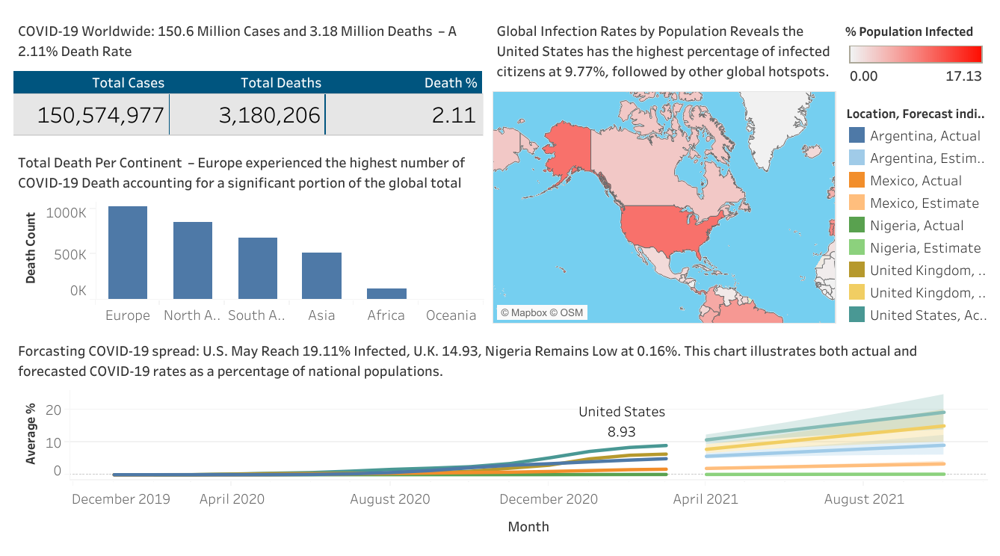

# COVID-19 Global Dashboard (Tableau)

This project presents a comprehensive Tableau dashboard analyzing global COVID-19 cases, deaths, and infection rates across continents and selected countries.

## Overview

The dashboard provides an interactive view of:

- *Total Global COVID-19 Cases and Deaths*  
  - Over 150 million cases  
  - More than 3.18 million deaths  
  - 2.11% global death rate

- *Deaths by Continent*  
  - Europe experienced the highest number of COVID-19 deaths  
  - Followed by North America, South America, and Asia

- *Global Infection Map*  
  - Displays percentage of population infected by country  
  - The United States shows the highest percentage infected (9.77%)

- *Forecast of COVID-19 Spread*  
  - U.S. projected to reach 19.11% infected  
  - U.K. projected at 14.93%  
  - Nigeria remains lowest at 0.16%

## Tools Used

- *Tableau Desktop Public Edition*  
  - Data visualization and interactive dashboard creation

## Key Insights

- The dashboard helps visualize the trajectory and impact of the COVID-19 pandemic over time.
- It highlights the disparity in infection and death rates across different continents.
- Forecast models offer a glimpse into potential future impacts on population health.

## How to Use

- Open the Tableau dashboard to interact with the visualizations.
- Hover over countries on the map to view infection rates.
- Examine forecast trends and compare actual vs. projected data.

## Screenshot

## Contact

Connect with me on [LinkedIn](https://www.linkedin.com/in/ifeanyieric)

Let me know if you’d also like to add a section for the dataset source or project motivation.
